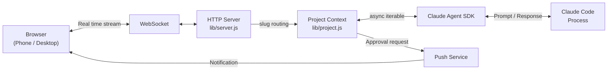
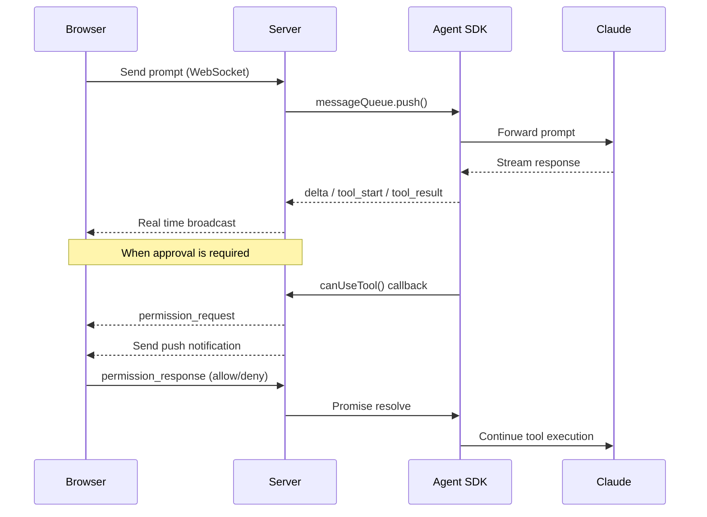
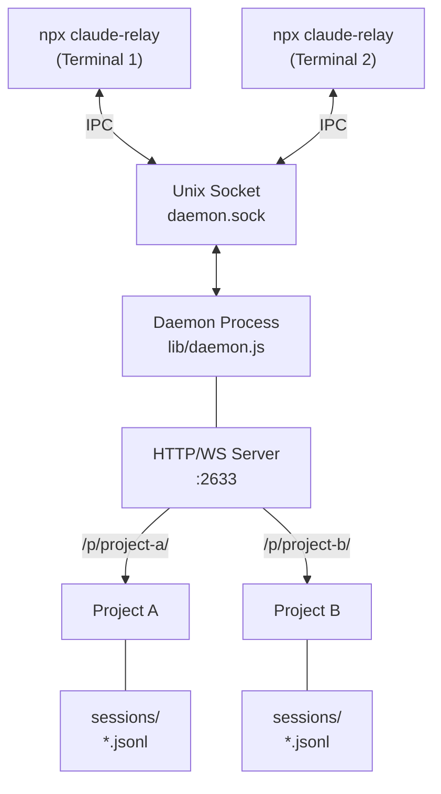

# Architecture

claude-relay is not a CLI wrapper.
It drives Claude Code directly via the [Claude Agent SDK](https://www.npmjs.com/package/@anthropic-ai/claude-agent-sdk).
It is a local relay server that keeps the same execution model while streaming to the browser over WebSocket.

## System Overview



## Request Flow



## Daemon Structure



The CLI spawns the daemon process with `detached: true`. The daemon keeps running in the background even after the CLI is closed. Multiple CLI instances connect to a single daemon via Unix Socket IPC.

## Key Design Decisions

| Decision | Rationale |
|----------|-----------|
| Unix Socket IPC | CLI–daemon communication without opening an additional TCP port |
| Background daemon | Server persists after CLI exits. Spawned with `detached: true` |
| JSONL session storage | Append-only for speed. Minimizes data loss on crashes |
| Slug-based routing | Multiple projects on a single port, separated by `/p/{slug}/` |
| Async Iterable | Connects the SDK message queue and response stream via async iterators |
| File path validation | Symlink resolution + blocks access outside the project directory |
| `0.0.0.0` binding + PIN | Allows LAN access with PIN authentication. VPN recommended for remote |

## Session Storage

Sessions are stored at `.claude-relay/sessions/{cliSessionId}.jsonl` inside the project directory.

```
Line 1:  {"type":"meta","localId":1,"cliSessionId":"...","title":"...","createdAt":...}
Line 2+: {"type":"user_message","text":"..."}
         {"type":"delta","text":"..."}
         {"type":"tool_start","id":"...","name":"..."}
         ...
```

The append-only JSONL format means at most the last line is lost on a crash. On daemon restart, all session files are read and restored.

## Permission Flow

1. The SDK invokes the `canUseTool()` callback
2. The server creates a Promise and stores it in `pendingPermissions[requestId]`
3. A `permission_request` message is sent to all connected clients
4. A push notification is sent
5. When a client sends a `permission_response`, the Promise is resolved
6. The SDK continues tool execution

## Multi-Project Routing

```
/                    → Dashboard (redirects if only one project)
/p/{slug}/           → Project UI
/p/{slug}/ws         → WebSocket connection
/p/{slug}/api/...    → Project API (push subscription, permission response, file access)
```

Slugs are auto-generated from the project directory name. Duplicates get `-2`, `-3`, etc.

## IPC Protocol

Line-delimited JSON over a Unix Domain Socket.

```
CLI → Daemon: {"cmd":"add_project","path":"/home/user/myproject"}\n
Daemon → CLI: {"ok":true,"slug":"myproject"}\n
```

Supported commands: `add_project`, `remove_project`, `get_status`, `set_pin`, `set_project_title`, `set_keep_awake`, `shutdown`
